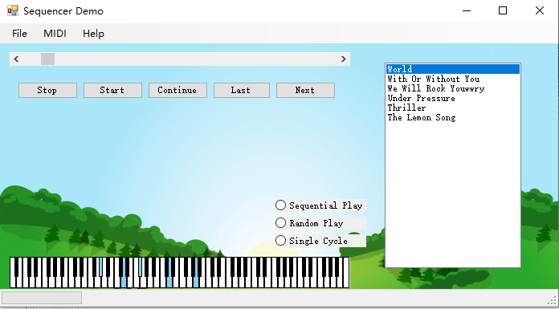

## 《Windows Form实现MIDI音乐文件的播放APP》实验报告
      学院：软件学院  班级：4 班    学号：3017218181  姓名：郑万杰
      日期：   2019年  4月 4 日
# 一、功能概述
    对原有的Windows Form应用程序进行修改，原有项目可以播放单个Midi文件，现在可以播放多个文件，播放的方式可以由用户设定。
# 二、项目特色
    1.添加一个列表，可以在列表中显示Midi文件名
    2.用户可以通过单选按钮设定播放方式：单曲循环、列表循环、随机播放
    3.界面大小可以随意变化，在调整界面大小之后，界面内的控件不会跟窗体的比例大小不会变化。
# 三、代码总量
     自己编写的代码大概200行左右。
# 四、工作时间
     3天
# 五、运行截图
    
# 六、结论
    阅读别人的源码，找到自己不懂的地方，然后去理解其内在的实现机制，从这次实验中，理解最深刻的就是多线程、委托跟事件。
   